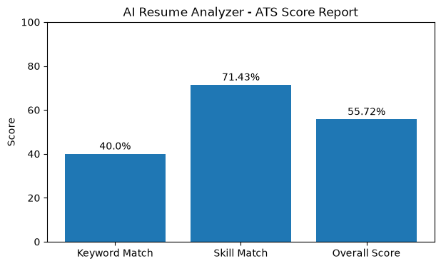

# AI Resume Analyzer

[](https://github.com/kevinnjogu-dev/ai-resume-analyzer/actions)

An AI-assisted resume analysis toolkit that evaluates resumes against job descriptions using ATS-style scoring, PDF parsing, structured evaluation metrics, and automated analysis workflows.

This project demonstrates practical applications of **AI evaluation, resume screening automation, prompt engineering concepts, structured scoring systems, and Python-based workflow automation**.

---

## Project Overview

Recruiters and hiring teams often review hundreds of resumes for a single position. This project simulates an Applicant Tracking System (ATS) workflow by analyzing resumes against job descriptions and generating transparent candidate evaluation scores.

The analyzer supports:

* Text-based resumes
* PDF resume extraction
* Job description matching
* Skill-based evaluation
* ATS-style scoring
* Automated analysis reports

The goal is to provide an explainable approach to resume screening rather than a black-box ranking system.

---

## Key Features

* Resume and job description comparison
* PDF resume parsing
* ATS-style scoring system
* Keyword match analysis
* Skill match evaluation
* Weighted candidate score calculation
* Candidate assessment generation
* JSON-based analysis reports
* Visualization dashboard
* Modular Python architecture
* Automated testing with pytest
* Continuous integration using GitHub Actions

---

## How It Works

```text
Resume + Job Description
          |
          ↓
Resume Text Extraction
(PDF / TXT Support)
          |
          ↓
Text Processing
          |
          ↓
Keyword Matching
          |
          ↓
Skill Evaluation
          |
          ↓
Weighted ATS Score
          |
          ↓
Candidate Assessment
          |
          ↓
Visualization Report
```

---

## Example Output

```json
{
    "keyword_match_score": 33.33,
    "skill_match_score": 80.0,
    "overall_score": 56.66,
    "assessment": "Weak Match"
}
```

---

## Dashboard Preview



---

## Repository Structure

```text
ai-resume-analyzer/

├── data/
├── docs/
├── examples/
├── notebooks/
├── prompts/
│
├── src/
│   ├── analyzer.py
│   ├── scoring.py
│   ├── utils.py
│   └── __init__.py
│
├── tests/
│   ├── test_scoring.py
│   ├── test_analyzer.py
│   └── test_pdf_parser.py
│
├── scripts/
│   └── create_sample_pdf.py
│
├── visualizations/
│   ├── dashboard.py
│   └── resume_score.png
│
├── README.md
├── requirements.txt
├── .gitignore
└── LICENSE
```

---

## Technologies

* Python
* PDF Processing (`pdfplumber`)
* Pytest
* Matplotlib
* JSON Data Processing
* GitHub Actions
* Prompt Engineering Concepts
* ATS Evaluation Workflows

---

## Running the Project

### Analyze a Resume

```bash
python -m src.analyzer
```

### Analyze a PDF Resume

```bash
python -m src.analyzer data/sample_resume.pdf data/sample_job_description.txt
```

### Generate Visualization

```bash
python visualizations/dashboard.py
```

### Run Tests

```bash
python -m pytest
```

---

## Testing

The project uses automated testing with pytest.

Current tests validate:

* Resume scoring logic
* ATS scoring calculations
* Resume analysis workflow
* PDF resume extraction

All tests run automatically through GitHub Actions.

---

## Future Improvements

Planned enhancements:

* Natural language processing improvements
* Semantic similarity using embeddings
* LLM-generated resume feedback
* ATS optimization recommendations
* Resume improvement suggestions
* Interactive web dashboard

---

## Releases

### v2.0 — PDF Parsing & CLI Support

Major improvements:

* Added PDF resume parsing
* Added command-line resume analysis
* Improved project architecture
* Added PDF extraction tests
* Expanded ATS evaluation workflow

---

## Author

**Kevin Njogu**

AI Trainer | LLM Evaluator | Machine Learning Enthusiast
